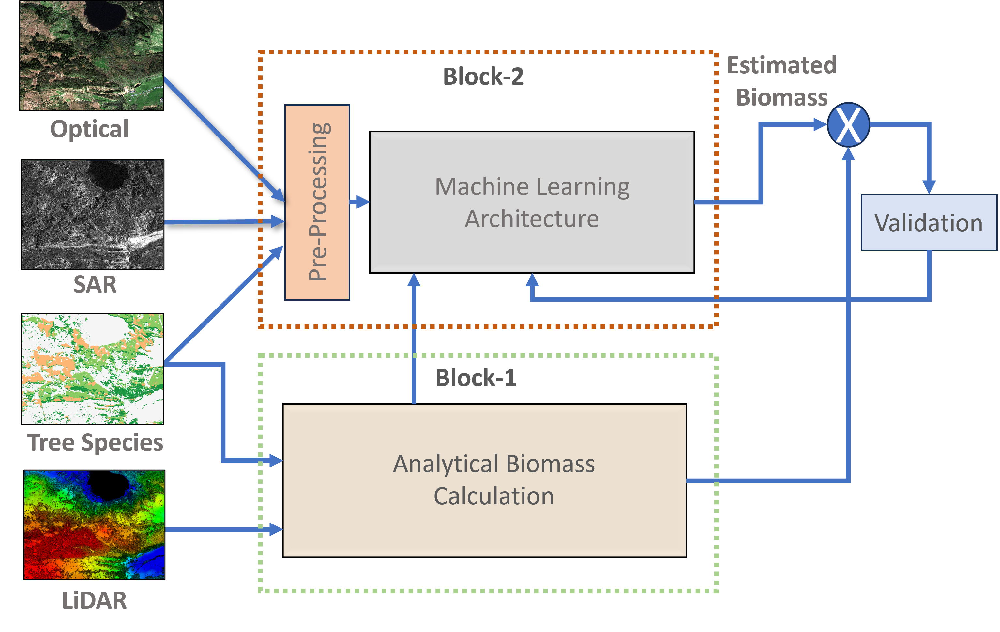

# Biomass Estimation Project



**Note: This project is still under development.**

## Overview

This project focuses on biomass estimation using a deep learning model named MDL-BIO. The model incorporates multi-modal data, including optical and Synthetic Aperture Radar (SAR) imagery, along with tree species information. The estimation is crucial for understanding and monitoring biomass in forest ecosystems.


## Table of Contents

- [Introduction](#introduction)
- [Features](#features)
- [Installation](#installation)
- [Usage](#usage)
- [Training](#training)
- [Results](#results)
- [Contributing](#contributing)
- [License](#license)

## Introduction

This project is dedicated to developing a robust biomass estimation model using deep learning techniques. The primary goal is to accurately assess the biomass of trees in forested areas, contributing to environmental monitoring and sustainable forestry practices.

## Features

- Multi-modal data integration
- Deep learning model (MDL-BIO)
- Optical and SAR image preprocessing
- Biomass estimation and results analysis

## Installation

To set up the project, follow these steps:

1. Clone the repository:

   ```bash
   git clone https://github.com/your-username/biomass-estimation-project.git
   cd biomass-estimation-project
